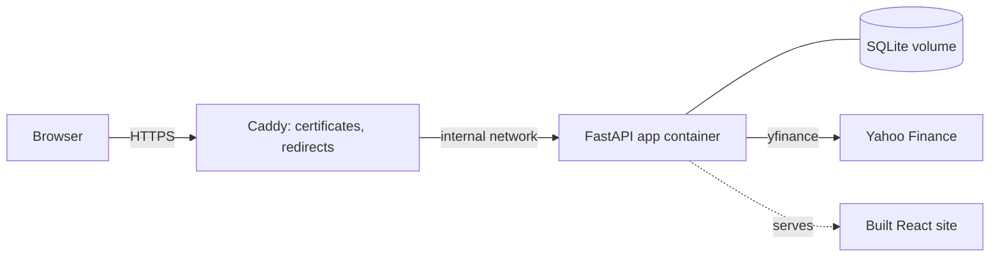

# StockWatcher

A full-stack stock research and portfolio dashboard: interactive charts with technical indicators, a market
overview, a valuation screener, and a portfolio tracker with login, multi-currency totals and performance history.

Built with **FastAPI**, **React + TypeScript** and **TradingView Lightweight Charts**, deployed with **Docker** and **Caddy**.

## Features

- **Chart:** candles or line, RSI, volume and MACD panes, a 21 EMA built from the right timeframe, and a metrics panel
- **Overview:** an S&P 500 heatmap (sized by market value, grouped by sector) and the main world indexes (NZX 50, KOSPI, ...)
- **Screener:** valuation checks (PEG, forward P/E against growth, margins, cash flow) and a short-term setup check
  (support, 21 EMA, RSI, MACD cross), each explained in plain English
- **Portfolio:** buys, sells and dividends in a ledger; holdings with cost basis and day change; cash accounts;
  sector breakdown; value over time; NZD and other currencies
- Light and dark themes, DD/MM/YYYY dates, sticky table headers

## Architecture



- `backend/app`: the API. `positions.py`, `history.py`, `breakdown.py`, `screener.py` and `markets.py` hold the maths as
  plain functions, so they are easy to test. `data.py` is the only file that knows where prices come from.
- `frontend/src`: the React app. `treemap.ts` is a squarified-treemap layout written from scratch.
- The ledger is the source of truth: positions, cost basis and history are always derived from the trades, never stored.

## Security

HTTPS with automatic certificates, argon2 password hashing, locked-down session cookies, login lockout, per-visitor
rate limits, a strict Content-Security-Policy, cross-site request checks, per-user data isolation, secrets from the
environment only. The full table is in [DEPLOY.md](DEPLOY.md#security-summary-good-to-be-able-to-explain).

## Run it locally

Backend (Windows PowerShell; use `source .venv/bin/activate` on Mac/Linux):

```powershell
cd backend
python -m venv .venv
.venv\Scripts\Activate.ps1
pip install -r requirements.txt
python -m app.create_user yourname
python -m uvicorn app.main:app --reload --port 8000
```

Frontend, in a second terminal:

```powershell
cd frontend
npm install
npm run dev
```

Open <http://localhost:5173>. Local data is kept in `~/StockWatcherData`, outside any synced folder.

## Tests

```powershell
cd backend
pip install -r requirements-dev.txt
pytest
```

Covers login, lockout and rate limits, security headers and cookies, data isolation, the portfolio maths, the history
calculation (checked against the holdings maths), market data handling, backups and the demo seeder. GitHub Actions
runs these and a production frontend build on every push.

## Deploy

See [DEPLOY.md](DEPLOY.md): one small server, Docker Compose, HTTPS, backups, and a hardening checklist.

## Data

Prices and company data come from Yahoo Finance through the unofficial `yfinance` library, which is suitable for
personal and educational use. A production service would use a licensed data provider. Nothing here is financial advice.
